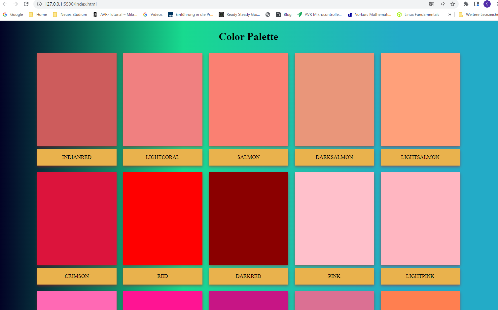
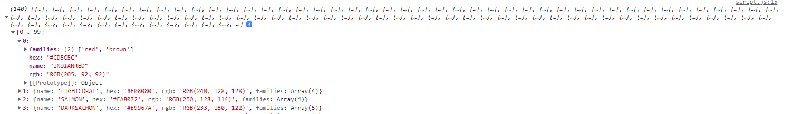
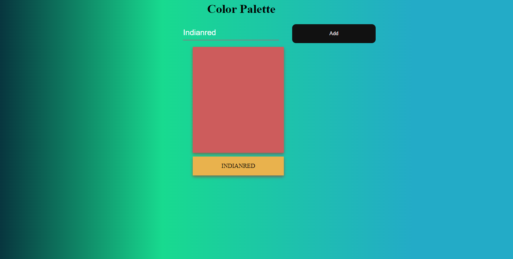

# Colorpalette

## Wichtig: Nicht Debugger nutzen für das Testing, sondern die Entwicklerkonsole in Browser. Das Bundlen von exportierten Module wie in der Aufgabe funktioniert nur erstmal im Browser (später dann mit node.js)!

Wir möchten nun eine scrollbare Farbpalette erzeugen. Bei der beiliegenden *color.js* Datei handelt es sich um Objekt, welches bereits 140 in allen Browsern darstellbare Farben enthält. Mit dem `export default` sowie dem `import colors from './color.js'` machen wir uns das Farbobjekt in unserer *script.js* zugänglich:   
   

## Aufgaben

1. Wir möchten nun die Farbkarten dynamisch nach Anzahl unserer Farben erzeugen. Lösche den entsprechende HTML Code der bereits erzeugten Karten (außer dem grundlegenden Container aller Karten!). Versuche dann mit Hilfe des *DOM Selektors* den Container auszuwählen und in einer Variable zu speichern.

2. Erzeuge nun eine passende Schleife, welche über das importierte Farbobjekt *colors* läuft. Lasse dir in der Schleife **Hallo Welt** ausgeben. Wie oft erscheint das **Hallo Welt**?

3. Erzeuge nun stattdessen in der Schleife genauso viele *div* Elemente wie du in HTML genutzt hast um eine Karte zu erzeugen.

4. Füge den erzeugten *div* Elemente entsprechend die passenden Klassen aus deiner *CSS* hinzu. *Tipp: `element.classList.add('css-klasse')`*
 
5. Nun müssen die entsprechenden *div* Elemente ihre Farbe und ihren Farbtext bekommen. Wo diese Informationen im Objekt stehen kann man entnehmen, indem man versucht auf den passenden Schlüssel zuzugreifen. Lasse dir das gesamte Objekt in der Konsole ausgeben.

6. Versuche nun auf den *name* Schlüssel und den *hex* Schlüssel aus dem Objekt zuzugreifen. Anschließend sollen damit die Farbe des entsprechenden *div* Elements und die Beschreibung geändert werden. 
<em><strong> 
    Tipp: element.keyName 
    Tipp 2: element.innerText = ...
</strong></em>

7. Zuletzt wollen wir die *div* Elemente strukturieren. Erinnere dich zurück an unsere Struktur der HTML Karten. Nutze nun *element.appendchild('divXY')* um die Element passend untereinander anzufügen.
   
Zuletzt wollen wir eine Suchleiste, die unsere Farben filtern kann, erzeugen.

8. Erzeuge in der *html* nun ein passendes Eingabefeld. Welche(s) *html-element(e)* solltest du hierfür verwenden? In der beiliegende *CSS* befinden sich schon vorgestylte Objekte. Du kannst, bei Bedarf diese benutzen oder auch eigenes Styling erstellen.

9. Mit einem sogenannten *eventlistener* kann man bestimmte Ereignisse, die das *DOM* betreffen erfassen. Die Methode `element.addeventlistener` (https://www.w3schools.com/js/js_htmldom_eventlistener.asp) ist ein *handler*, der eine Event erfassen kann (z.B von einem *html-element*) und mit einer *function* verarbeiten kann.
Überlege dir welches *element* du erfassen musst, wenn du auf den Button klickst, rüfe darauf den *addeventlistner* mit einer Funktion auf.
Greife auf den Wert des Eingabefelds zu und vergleiche diese mit allen Werten aus dem Farbobjekt.
Recherchiere wie du die bereits erzeugten Elemente aus der *DOM* entfernen kannst.
Erzeuge nun ähnlich der Aufgabe 7 eine Karte nur für den eingegeben Wert. 

10. Sollte ein nicht vorhandener Wert eingegeben werden, sollen weiterhin alle Karten angezeigt werden. 

Es gibt viele weitere Dinge die du in diesem Projekt entdecken kannst. So kannst du die Datei aus dem Dateiverzeichnis in den Browser ziehen und bekommst eine Fehlermeldung (statt den *Liveserver* als Startpunkt zu nutzen). Außerdem kann man das Programm auf verschiedene Arten verbessern (Eingabe durch Keyboardpress, leeren des Eingabefelds nach Eingabebestätigung...). Das weitere Experimentieren bleibt dir überlassen :-)

 

# Color-Palette
